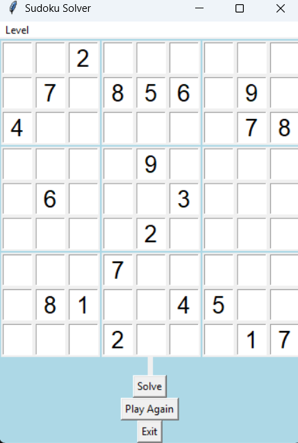
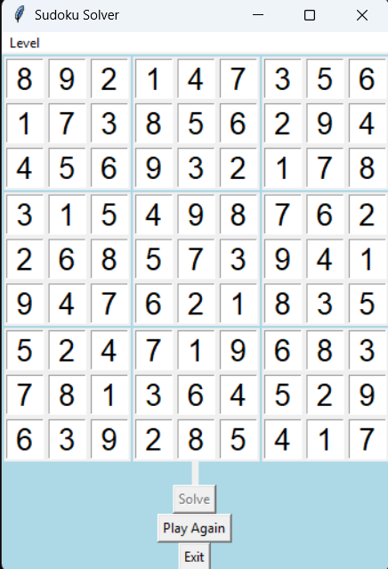
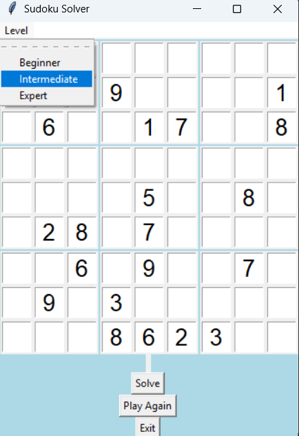

# Sudoku Solver – Python

A simple and interactive Sudoku solver built with Python's Tkinter GUI library.

## Features
- Solve Sudoku puzzles instantly
- Choose difficulty levels: Beginner, Intermediate, Expert
- "Play Again" feature to load a new board
- Highlights invalid input
- User-friendly design using Tkinter

## Technologies Used
- Python
- Tkinter GUI

